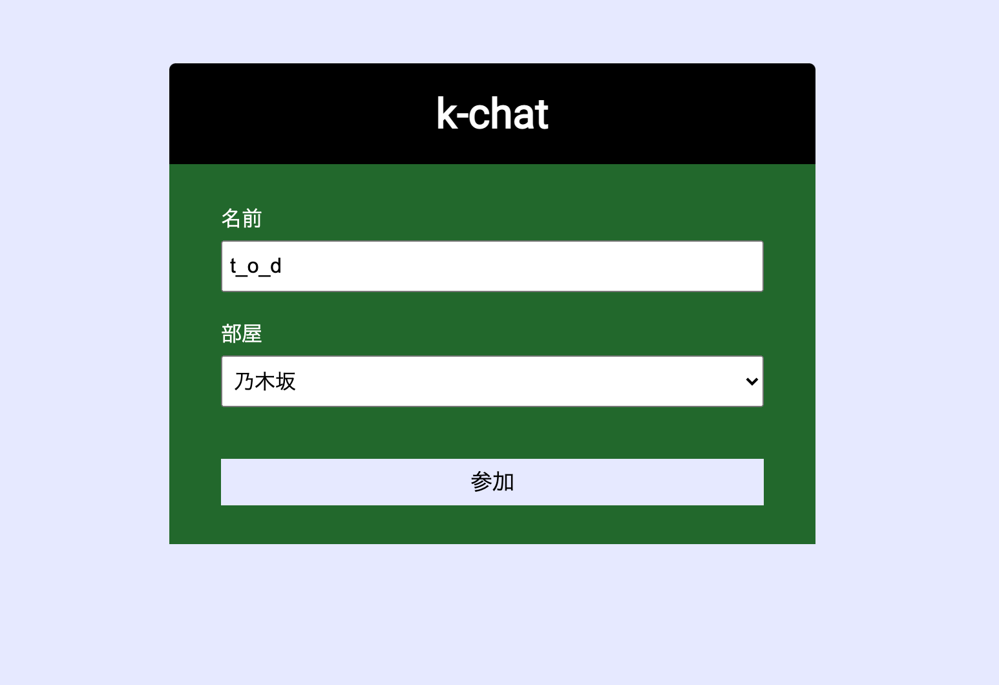
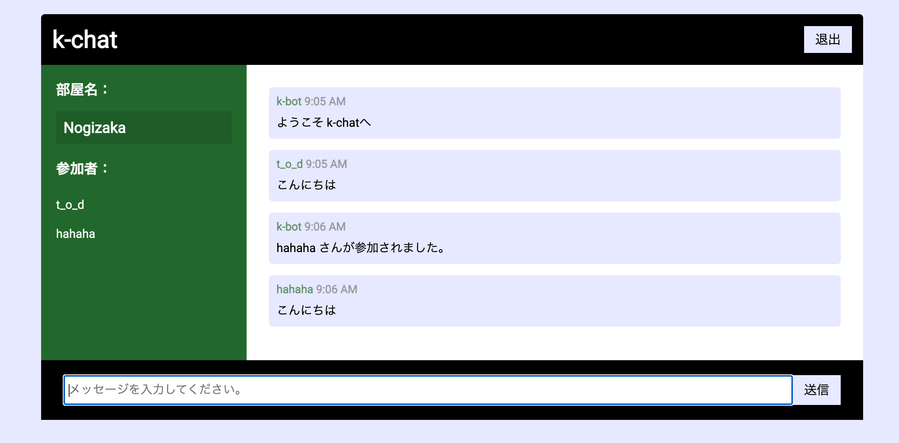

# chatサービス作り方セミナー

## 概要
- このレッスンでは、javascript及び周辺のライブラリを用いてチャットアプリを作成していく。
- このアプリの作成を一連で行うことで、以下が身に付く。
  - FWを用いたnodejsでのサーバーサイドの構築
  - javascriptの新しい書き方であるESMへの対応。
  - [web socket](https://atmarkit.itmedia.co.jp/ait/articles/1603/14/news015.html)を用いた双方向通信アプリの実装。

## 成果物
- このレッスンを通して最終的な成果物となるアプリを以下に示す。





- また成果物のソースコードは以下。
  - [k-chat](https://github.com/Kamekure-Maisuke/k-chat)

## 環境
- Mac OS 11.2.3
- node v14.16.0
- npm 7.19.1

## 手順

### 雛形作成
- 以下で雛形を作成する。

```bash
# アプリの情報やライブラリを管理するためのpackage.jsonが作成
$ npm init -y

# エントリーポイント(実行を開始する場所及びファイル)のjsを作成
$ touch index.js
```

- 作成された`package.json`が正しく設定されているか確認。

### ライブラリ導入
- 今回作成にあたり必要なnodeライブラリは以下。
  - koa
    - リクエストやレスポンス等といった基本機能が入ったnode FW
  - koa-static
    - koaで静的ファイルを扱うためのライブラリ
  - socket.io
    - web socketを扱うためのライブラリ
  - date-fns
    - 日付処理を扱うためのライブラリ。任意のものを使用してよい。
  - nodemon
    - ホットリロード環境のためのライブラリ。

- 確認後、以下のコマンドでインストール。

```bash
# dependencies
$ npm i koa koa-static socket.io date-fns

# devDependencies
npm i -D nodemon
```

### esm対応
- javascriptをesmという最新の仕様に沿った書き方にする。
- 方法は`package.json`に以下の記述を追加するだけで良い。

```json
"type": "module"
```

### サーバー構築とhtml描画
- 基盤となるサーバー構築をするため、以下をそれぞれ記述する。

```js:index.js
import Koa from 'koa'

const app = new Koa();

app.listen(3000,() => {
  console.log('server start 3000')
})
```

```json:package.json
***
"scripts": {
  "dev": "nodemon index.js"
}
***
```

- 記述後、以下のコマンドをうち、以下の挙動を確認する。
  - ターミナル上に`server start 3000`のログが出ているか確認する。
  - `localhost:3000`へブラウザでアクセスして起動しているか確認する。

- 次に`localhost:3000`の画面へhtmlを描画するため、以下のようにjsファイルを修正する。

```js:index.js
import Koa from 'koa'
import assets from 'koa-static'

const app = new Koa();
app.use(assets('public'));
```

- 修正後、以下でpublicフォルダを作成して任意のhtmlファイルを作成する。

```bash
mkdir public

echo "<h1>タイトル</h1>" > public/index.html
```

- `localhost:3000`にアクセスして、htmlファイルが描画されていることを確認する。

### socketioの組み込み
- 今回作成するチャットアプリではweb socket処理を利用するが、これらを扱うのに便利なsocket.ioをjsファイルに組み込む必要がある。
- socket.ioはクライアントとサーバーの両方で構成されている。
- まずクライアントで利用するために、以下のpublicディレクトリの中身を修正する。

```html:public/index.html
<!DOCTYPE html>
<html lang="ja">

<head>
  <meta charset="UTF-8" />
  <meta name="viewport" content="width=device-width, initial-scale=1.0" />
  <title>k-chat</title>
</head>

<body>
  <div class="chat-container">
    <header class="chat-header">
      <h1>k-chat</h1>
      <a href="index.html" class="btn">退出</a>
    </header>
    <main class="chat-main">
      <div class="chat-sidebar">
        <h3>部屋名：</h3>
        <h2 id="room-name"></h2>
        <h3>参加者：</h3>
        <ul id="users"></ul>
      </div>
      <div class="chat-messages"></div>
    </main>
    <div class="chat-form-container">
      <form id="chat-form">
        <input id="msg" type="text" placeholder="メッセージを入力してください。" required autocomplete="off" />
        <button class="btn">送信</button>
      </form>
    </div>
  </div>
  <script defer src="/socket.io/socket.io.js"></script>
  <script defer src="./main.js"></script>
</body>

</html>
```

```js:src/index.js
const socket = io();
```

- 次にサーバで利用するために、root直下のindex.jsを以下のように修正する。

```js:index.js
import Koa from 'koa'
import assets from 'koa-static'
import { Server } from 'socket.io'

const app = new Koa();
app.use(assets('public'));

const server = app.listen(3000);

// socketオブジェクトをserverに渡す。
const io = new Server(server);

io.on('connection', (socket) => {
  console.log('接続')
})
```

- `localhost:3000`へアクセスして、以下の挙動を確認する。
  - htmlの描画とjsのライブラリ読み込みが正常かどうか。(開発者コンソールで確認)
  - ターミナル上に`接続`のログが出ているかどうか。

- 確認後、socket.ioの組み込みが初期組み込みが完了したので、第一段階完了。
