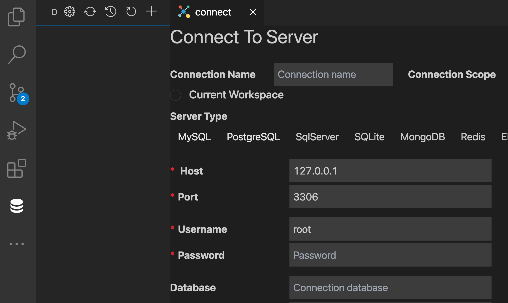

# Web開発基礎_1

## 概要
- このレッスンでは簡単なタスク管理アプリを作成していただくことで、Web開発の一連の流れを体験することができます。
- 以下のような知識の習得が可能。
  - コンテナを用いた環境の作成
  - DBとNode.jsを用いたAPI作成
  - マイグレーションの利用
  - ORMの利用
  - フロントとサーバー間でのリクエスト通信
  - Vue3の知識

## 流れ
- レッスンの流れは以下。
  - db環境の作成
  - プロジェクトの作成
  - 成果物確認
  - Githubにあげる。
  - まとめ

## 環境
- Darwin Mac 20.3.0
- Visual Studio Code
- Docker version 20.10.8
- docker-compose version 1.29.2

## 手順

### プロジェクトフォルダ作成
- プロジェクト用の任意のフォルダを作成する。

```bash
# プロジェクトフォルダの作成及び移動
mkdir mta; cd $_
```

### db
- まずMySQLやPostgressDBといったWeb開発に必要なRDBの環境を構築する。
- ホストPCに直接インストールしたりMAMPのような実行フリーソフトを利用するのも良いが、今回はDockerを利用してコンテナ内に環境を構築する。
- Dockerを用いて環境構築することで以下の利点が得られる。
  - 直接PCに環境を作らなくて良い。
    - そのため汚すことがない。
  - 使い捨てが可能。
    - 環境をソフト化するため、必要がない場合は一発で削除が可能。
  - パッケージとしての提供が可能。
    - 必要なライブラリやデータを入れたものを保存しておけば、外部へ提供可能なソフトとなる。
- そこで必要なディレクトリやファイルを作成する。

```bash
# dbコンテナ用
mkdir docker
# mysql設定ファイル用
mkdir docker/db
# MySQL設定ファイルとコンテナ設定ファイルの作成
touch docker/db/my.cnf docker/docker-compose.yml
```

- 作成した`my.cnf`と`docker-compose.yml`を以下のように記述。

```conf
[mysqld]
character-set-server=utf8mb4

[mysql]
default-character-set=utf8mb4

[client]
default-character-set=utf8mb4
```

```yaml
version: "3.7"
services:
  db:
    image: mysql:8.0
    environment:
      - "MYSQL_DATABASE=mta"
      - "MYSQL_ROOT_PASSWORD=root"
    ports:
      - "13306:3306"
    restart: always
    volumes:
      - ./db/data:/var/lib/mysql
      - ./db/my.cnf:/etc/mysql/conf.d/my.cnf
```

- 記述後、以下を実行してdbコンテナを構築アンド起動。

```bash
cd docker
# コンテナをバックグラウンドで起動
docker-compose up -d
```

- 起動確認を行う必要がありCLI上で行うこともできるが、Web開発においてそれらをGUIで行うクライアントツールを利用するのが一般的である。
- 代表例でいえば、[phpmyadmin](https://www.phpmyadmin.net/)や[sequelpro](https://www.sequelpro.com/)等がある。
- 今回は開発エディタにVisualStudioCodeを利用していることもあり、拡張機能を用いることでエディタ内でクライアントツールを利用する。
- まず、Visual Studio Codeの拡張機能検索(Ctrl + Shift + X)でmysqlを検索。
- 複数件ヒットするため、「cweijan」のものをinstall。
- インストール後、VSCodeの左に出現したデータベースのマークをクリックして、出てきた画面の上の「+」ボタンをクリックして、以下のようになることを確認する。



- 確認後、この画面に以下の接続情報を入力する。
  - Host: localhost
  - Port: 13306
    - `docker-compose.yml`で設定したports
  - Username: root
  - password: root
  - Database: sample
    - それぞれ`compose.yml`で設定したenvironments
- 入力後、「connect」ボタンを左にテーブル一覧が出れば完了。
- 一通り触ってみて、使用感をはかる。
- 完了。

## 次回
- 次は実際にバックエンド環境を用意してDBと繋いでAPI環境を作成する。